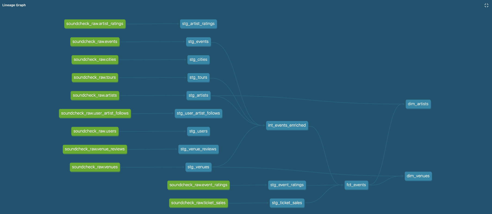

# Soundcheck Analytics

A modern analytics engineering portfolio project demonstrating end-to-end data pipeline development for a music industry analytics platform.

**Tech Stack:** Python • BigQuery • dbt Core • Looker Studio

---

## Project Overview

Soundcheck is a music analytics platform that tracks concert performance, venue operations, and fan engagement. This project demonstrates production-grade data engineering practices from raw data generation through business intelligence dashboards.

**Business Questions Answered:**
- Which artists consistently sell out shows?
- What's the optimal ticket pricing by venue and artist popularity?
- How does seasonality affect concert attendance?
- Which venues have the highest revenue per event?

---

## Architecture
```
Python Data Generator → BigQuery (Raw Storage) → dbt (Transform) → Looker Studio (Visualize)
```

**Data Flow:**
1. **Source**: Synthetic data (1.1GB, 11 tables) with realistic music industry patterns
2. **Warehouse**: BigQuery with partitioned fact tables for query performance
3. **Transform**: dbt models following dimensional modeling (staging → intermediate → marts)
4. **Visualize**: Looker Studio dashboards for stakeholder insights

---

## Data Model

### Staging Layer (11 models)
Clean, normalized versions of raw source tables

### Intermediate Layer (1 model)
- `int_events_enriched` - Events joined with artist, venue, and tour context

### Marts Layer (3 models)
- `fct_events` - Event performance metrics (ratings, sales, attendance)
- `dim_artists` - Artist profiles with aggregated performance stats
- `dim_venues` - Venue profiles with utilization and revenue metrics



---

## Key Features

**Data Quality**
- 16 automated dbt tests (uniqueness, nulls, referential integrity)
- All tests passing ✅

**Performance Optimization**
- Partitioned tables for large datasets (ticket_sales: 1GB, event_ratings: 97MB)
- Materialization strategy: Views for staging, tables for marts

**Documentation**
- Auto-generated dbt docs with data lineage visualization
- Column-level descriptions and business logic

---

## Technical Highlights

**Dimensional Modeling**
- Star schema design with fact and dimension tables
- Proper foreign key relationships enforced via dbt tests

**Data Transformations**
- Complex joins across 6 source tables
- Business logic: capacity utilization, price tiers, sold-out flags
- Aggregations: Event-level and artist/venue-level metrics

**Synthetic Data Generation**
- Python script creates realistic patterns (seasonality, venue capacity constraints)

---

## Repository Structure
```
soundcheck-analytics/
├── generator/           # Python data generation scripts
├── dbt/
│   ├── models/
│   │   ├── staging/    # 11 cleaned source tables
│   │   ├── intermediate/  # Enriched event data
│   │   └── marts/      # Analytics-ready tables
│   └── tests/          # Data quality validations
├── images/             # Project screenshots
└── README.md
```

---

## Getting Started

### Prerequisites
- Google Cloud Platform account
- Python 3.9+
- dbt Core with BigQuery adapter

### Run the Pipeline
```bash
# 1. Generate synthetic data
cd generator/
python generate_data.py

# 2. Load to BigQuery
# (Files uploaded via BigQuery console)

# 3. Run dbt transformations
cd dbt/
dbt run

# 4. Run tests
dbt test

# 5. Generate documentation
dbt docs generate
dbt docs serve
```

---

## Project Status

**Completed:**
- ✅ Synthetic data generation (11 tables, 1.1GB)
- ✅ BigQuery data warehouse setup with partitioning
- ✅ dbt transformation pipeline (15 models)
- ✅ Data quality testing (16 tests, all passing)
- ✅ Documentation and lineage visualization

**In Progress:**
- 🚧 Looker Studio dashboard development

**Future Enhancements:**
- User behavior analysis (user segments, purchase patterns)
- Geographic insights (city-level performance)
- Incremental model optimization for large tables

---

## Contact

**Brendan Bullivant**  
📧 bpbullivant3@gmail.com  
🔗 [linkedin.com/in/brendan-bullivant](https://www.linkedin.com/in/brendan-bullivant)